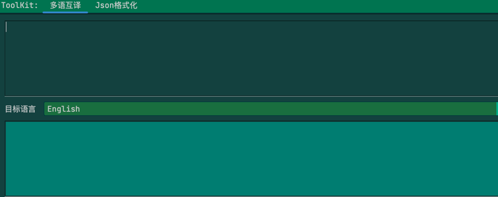

# SlowToolkit

#### 介绍
一个用来在工作中提高生产力的插件，也是一个idea plugin学习项目，欢迎学习指正

#### 安装教程

官方插件市场搜索SlowToolkit

#### 相关功能列表
1. 生成项目脚手架
2. 工具包
    1. 翻译功能
       
    2. json格式化
       
3. mybatis-plus注解,@RequestParam一键生成
4. 实体类生成json
5. 智能创建实体类
    1. 小写字母开头自动创建包
    2. 可以一次创建多个实体类，用"，"分割，可以和idea自带模版联动
    3. 如果剪切板有json，生成实体类中会填充json中的字段
6. 通过数据库右键生成实体类

#### 参与贡献

#### 规划中功能

1. 自定义组建
2. 通过json生成实体类，通过sql生成实体类，坐在智能生成类的功能里
3. ToolKit增加工具栏，动态配置属性
4. 修改ToolKit图标
5. 优化生成项目脚手架
6. 动态配置项目功能
7. 优化代码结构
